# ApexMQTT (AXMQ) 实验可复现性与实证深度指南

本手册为《AXMQ 技术白皮书》的配套技术文档。旨在通过保姆级的指令清单，消除实验环境差异，确保第三方在阿里云（或同等规格环境）下能 100% 复现单机百万连接与数百万 TPS 的性能指标。

---

## 0. 核心实证摘要 (Executive Summary)

基于 2025 年 12 月的最新实测数据，ApexMQTT (AXMQ) 在与行业主流 Broker (EMQX) 的同机 A/B 对比实验中，展现了代差级的架构优势：

### 0.1 资源密度：11 倍内存效率
*   **ApexMQTT**: 维持 100 万连接仅需 **1.63 GB** 内存（RES）。
*   **EMQX**: 维持 100 万连接需要 **18.32 GB** 内存（RES）。
*   **结论**：在同等硬件成本下，AXMQ 可支撑 10 倍以上的设备接入量。

### 0.2 实时性：28 倍稳定性领先 (P95)
*   **ApexMQTT (P95)**: **301 µs** (亚毫秒级稳定)。
*   **EMQX (P95)**: **8580 µs** (8.5 毫秒)。
*   **结论**：得益于 **D-IO 非对称调度模型**，AXMQ 在百万连接背景下依然能提供极速响应，彻底消除了大规模并发下的调度抖动。

### 0.3 协议吞吐：复杂场景优势扩大
*   **QoS 1 吞吐**: AXMQ 领先 **13%** (64.3 vs 56.7 MB/s)。
*   **QoS 2 吞吐**: AXMQ 领先 **26%** (41.3 vs 32.8 MB/s)。
*   **结论**：在需要协议握手的复杂交互中，AXMQ 的智能 CORK 与异步任务池展现了更高的系统调用合并效率。

### 0.4 系统鲁棒性：工业级健壮性
*   **压力激变测试**：在 50 万连接突发中断场景下，AXMQ 宿主机 SSH 操作始终流畅；对比组出现约 40 秒的系统级卡死（调度风暴）。
*   **结论**：AXMQ 能够平滑卸载极端网络波动带来的冲击，确保管理平面的高可用。

---

## 0.5 免责声明 (Disclaimer)

本测试报告主要针对学术研究与架构设计探讨，所有测试结果均基于公开的实验环境与公平的参数配置。我们无意针对任何商业产品的好坏进行主观评判，所有数据分析均旨在揭示不同并发模型（D-IO vs Erlang Process）的技术特征。

选择 EMQX 作为 A/B 对比对象，是因为其在当前 MQTT 领域占据绝对主导地位，其基于 Erlang/OTP 的电信级稳定性与高性能已服务于全球海量工业场景，是公认的行业性能天花板。为了确保对比的“含金量”，我们对市面主流 Broker 进行了筛选，仅保留了最具代表性的成熟产品：

| MQTT Broker | 技术栈 | 选型分析与局限性 |
| :--- | :--- | :--- |
| **Mosquitto** | C 语言 | 经典的单进程单线程架构，无法有效利用多核 CPU 优势。在大规模并发与百万级连接压测场景下缺乏实测价值。 |
| **Aedes / Mosca** | Node.js | 基于 JavaScript 事件循环。虽然开发便捷，但在极致吞吐与系统级调度稳定性上与工业级产品存在代差，非高性能首选。 |
| **Rumqttd** | Rust / Tokio | 尽管 Rust 理论性能卓越，但现阶段其生态核心（如 Tokio）在处理海量长连接的极致网络 IO 调度上仍处于演进中，尚未在百万级生产环境下得到广泛的稳健性验证。 |
| **EMQX** | **Erlang / OTP** | **基于电信级 OTP 平台，原生支持百万级轻量级进程调度，其成熟度与技术性能处于行业顶尖水平。选择它作为对手，是为了在最高水平的基准线上进行学术分析。** |

**正是基于学术研究的严谨性，我们公开了本测试指南中的全部实验流程、核心工具及指令清单。我们对所有复现者持公平、公正、公开的学术态度，确保本研究在阳光下接受全球同行评议与验证。**

---

## 1. 实验资源清单 (Hardware Inventory)

> **开源说明**：本指南涉及的所有性能采集脚本、系统优化工具均已开源于 [GitHub: AXMQ-Flash](https://github.com/AXMQ-NET/AXMQ-Flash)。复现者可直接从该仓库的 `metrics` 目录下载最新版脚本进行回测。

### 1.1 节点配置对比
| 角色 | 阿里云规格 | 核心/内存 | 操作系统 | 核心目的 |
| :--- | :--- | :--- | :--- | :--- |
| **Broker (SUT)** | `ecs.c5.6xlarge` | 24 vCPU / 48G | Ubuntu 24.04 | 验证 D-IO 模型在有限资源下的极限吞吐 |
| **LoadGen (Tester)** | `ecs.c7a.32xlarge` | 128 vCPU / 256G | Ubuntu 24.04 | 产生压力，模拟百万级异构客户端 |
| **Prober (Latency Probe)** | `ecs.u1-c1m1.xlarge` | 4 vCPU / 4G | Ubuntu 24.04 | 独立测量 P99，避免与 1M 压测共享运行时/内核资源 |

#### 1.1.1 阿里云实例详情截图（环境与 IP 闭环证据）

下列截图均为阿里云控制台“运行中”状态详情，用于证明实验环境的一致性。**注意：图中显示的“主私网 IP”与本指南后续所有命令示例（如 172.28.130.87）完全对齐。**

**Broker (SUT) 详情信息：**
- 规格：`ecs.c5.6xlarge` (24 vCPU / 48 GiB)
- 私网 IP：`172.28.130.87` (本指南默认 Broker IP)


**LoadGen (Tester) 详情信息：**
- 规格：`ecs.c7a.32xlarge` (128 vCPU / 256 GiB)
- 私网 IP：`172.28.130.110`


**Prober (Latency Probe) 详情信息：**
- 规格：`ecs.u1-c1m1.xlarge` (4 vCPU / 4 GiB)
- 私网 IP：`172.28.130.89`


### 1.2 网络拓扑
*   **私网环境**：所有测试必须在同一 VPC 子网内进行，以规避公网带宽限制。
*   **带宽说明**：云实例网络带宽受规格/弹性带宽/突发策略影响。本文档中的 “5.44 Gbps” 是特定工作负载下的**应用侧观测值**；如需严谨记录带宽与包速率，请以 **`/proc/net/dev` 或 `ip -s link`** 的 bytes/packets 计数为准（见 4.1 节观测点）。

#### 1.2.1 安全组配置（关键）

为确保 LoadGen 和 Prober 节点能正常连接到 Broker，必须在阿里云安全组中放行 **1883** 端口。

**安全组规则示例：**

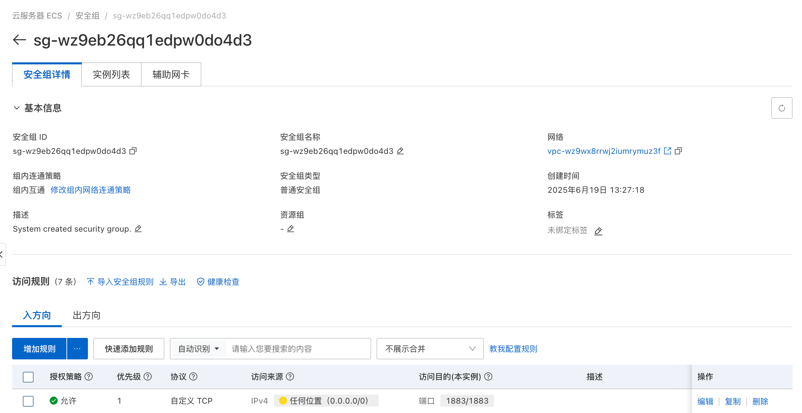

---

## 2. 基础设施一键配置 (Infrastructure Setup)

### 2.1 A/B 公平性前置：两组都必须启用同一套系统参数（否则失去对比测试意义）

为保证对比公平，**ApexMQTT 与 EMQX 都必须在启动前**在 Broker (SUT) 上执行同一套系统参数优化。

在 Broker (SUT) 上执行 `apply_sysctl_common.sh`（命令行即时生效，不改配置文件）：

```bash
root@iZwz98cc88moyz436qmlj0Z:~# sudo ./apply_sysctl_common.sh 
[1/3] 提升文件描述符/文件表上限（即时生效）
fs.nr_open = 2000000
fs.file-max = 2000000
[2/3] 提升连接队列/积压队列深度
net.core.netdev_max_backlog = 65536
net.core.somaxconn = 65535
net.ipv4.tcp_max_syn_backlog = 65535
[3/3] TCP 缓冲区与端口相关（与复现指南保持一致）
net.core.wmem_max = 16777216
net.core.rmem_max = 16777216
net.ipv4.tcp_wmem = 4096 4096 16777216
net.ipv4.tcp_rmem = 4096 4096 16777216
net.ipv4.tcp_tw_reuse = 1
net.ipv4.ip_local_port_range = 1024 65535
完成。建议同时在当前 shell 执行：ulimit -n 1048576

# 随后手动执行并验证 ulimit
root@iZwz98cc88moyz436qmlj0Z:~# ulimit -n 1048576
root@iZwz98cc88moyz436qmlj0Z:~# ulimit -n
1048576
```

说明：
- `apply_sysctl_common.sh` 只做“命令行即时生效”的 sysctl 设置，不修改 `/etc/sysctl.conf`。

#### 2.2 实验洁净度与公平性原则 (Clean Slate Principle)

为彻底消除由于内存碎片、内核状态残留（如 TIME_WAIT 句柄）对后续实验的影响，本指南遵循以下**强制性公平原则**：

*   **Broker 侧 (SUT)**：在进行每一阶梯（10万、50万、100万）的正式采集前，必须**重新启动** Broker 程序（ApexMQTT 或 EMQX）。这确保了 A/B 两组在采集稳态数据时，进程内部状态均处于“初始洁净态”。
*   **LoadGen 侧 (Tester)**：在每一阶梯测试完成后，必须对负载机执行 **`sudo reboot` 重启操作系统**。这是为了彻底排干内核网络协议栈中的残留状态（尤其是 1M 连接下海量的连接追踪表和 Socket 释放延迟），保证每一轮压测发起时负载机的资源都是绝对一致的。

### 2.3 LoadGen 侧：多 IP 绑定与工具链

#### 2.3.1 LoadGen 侧：系统限制突破 (必做)

与 Broker 类似，压力机也必须解除端口与文件描述符限制，否则无法发起百万级连接。

在 **LoadGen 节点**上执行：
```bash
# 提升文件描述符上限
ulimit -n 1048576

# 解除临时端口范围限制（使每个 IP 可用端口数从默认的 ~2.8万 提升至 ~6.4 万）
sudo sysctl -w net.ipv4.ip_local_port_range="1024 65535"

# 提升连接追踪上限（防止在大规模建链时内核丢包）
# 注意：若提示目录不存在，需先执行 sudo modprobe nf_conntrack
sudo modprobe nf_conntrack
sudo sysctl -w net.netfilter.nf_conntrack_max=1048576
```

#### 2.4 阿里云控制台：分配辅助私网 IP

不同账号/地区/实例规格的控制台入口会略有差异，但本质目标一致：**给 LoadGen 主网卡（ENI）分配多个 Secondary Private IP（辅助私网 IP）**，并确保这些 IP 与 Broker 在同一 VPC/交换机（子网）。

建议操作思路（通用描述）：

- 进入阿里云控制台，找到 **LoadGen 的 ECS 实例**
- 进入实例的 **弹性网卡 / 管理弹性网卡IP / + 添加 ** 相关功能
- 为主网卡分配多个 **辅助私网 IP（Secondary Private IP）**（建议至少分配 20 个）
- 确认这些 IP 都在同一 **VPC/交换机**，且安全组 允许到 Broker服务器 :1883 端口开放

**辅助私网 IP 配置示例：**

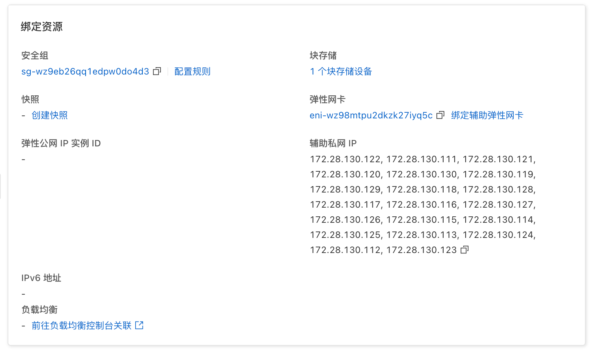

#### 2.5 Linux 侧：绑定与验证（LoadGen 节点）

在阿里云侧分配完辅助私网 IP 后，Linux 上通常需要把这些 IP 加到网卡上（否则 `--ifaddr` 可能不可用）：

```bash
# [步骤 1] 批量绑定辅助 IP（已根据 2.1.1 节截图确认，IP 范围为 .111 至 .130，共 20 个）
for i in {111..130}; do
    sudo ip addr add 172.28.130.$i/20 dev eth0
done

# [验证 1] 确认网卡上已出现所有辅助 IP
ip addr show dev eth0

# [验证 2] 用指定源 IP 测试到 Broker 的连通性（每次挑一个 IP 测）
ping -c 1 -I 172.28.130.111 172.28.130.87

# [验证 3] 常见失败现象：若没绑 IP/没分配 IP，会在 6.5 万连接附近报 eaddrnotavail
```

下载压测工具：
```bash
# 注意：Ubuntu 24.04 必须使用 debian12 编译版，否则会报 OpenSSL 缺少 libssl.so.1.1 错误
wget https://github.com/emqx/emqtt-bench/releases/download/0.6.1/emqtt-bench-0.6.1-debian12-amd64.tar.gz
tar -xzvf emqtt-bench-0.6.1-debian12-amd64.tar.gz
```

---

## 3. 实验：C1M 百万连接

> **程序准备**：在开始实验前，请确保从 [AXMQ-NET/ApexMQTT](https://github.com/AXMQ-NET/ApexMQTT/releases) 下载最新版本的 `ApexMQTT_amd64_linux` 二进制文件及 `conf.yml` 配置文件，并上传至 Broker 节点的工作目录。

### 3.1 启动 Broker
```bash
root@iZwz98cc88moyz436qmlj0Z:~# ./ApexMQTT_amd64_linux 
2025/12/30 16:16:24 Dashboard starting on http://:80 (Login Password: Z0RSv3JN)
2025/12/30 16:16:24 Memory Guard: Total RAM=46GB, GlobalLimit=32.20GB, PerConnLimit=256MB, MaxOutbound=9M
2025/12/30 16:16:24 Listening on :1883 (Plaintext)
2025/12/30 16:16:24 Listening on :8083 (Plaintext)
2025/12/30 16:16:24 AXMQ (ApexMQTT) v1.1.7 build golang v1.24.9
2025/12/30 16:16:24 axmq.net
```

#### 3.1.1 进入管理后台开启“压测模式” (必做)

启动后，必须进入 Web 管理后台关闭安全引擎的自动封禁功能，否则高频压测流量会被识别为攻击，从而主动防御后无法正常压测。

1.  **访问地址**：浏览器访问 `http://<Broker_IP>:80`。
2.  **登录密码**：查看控制台输出的 `Login Password`（如上述示例中的 `Z0RSv3JN`）。
    -   **小技巧**：如需使用固定密码，可编辑程序目录下的 `conf.yml` 文件，修改 `dashboard_pass: "你的密码"` 字段。保存后重启程序，即可永久使用该固定密码登录。
3.  **关键配置**：
    -   导航至 ** 系统配置 ** 页面。
    -   开启 **禁用攻击计分 (压测模式)**。
    -   **说明**：开启后，系统将不再记录 IP 违规分值，适用于模拟百万级连接或高频 TPS 的压力测试场景。

**配置参考截图：**

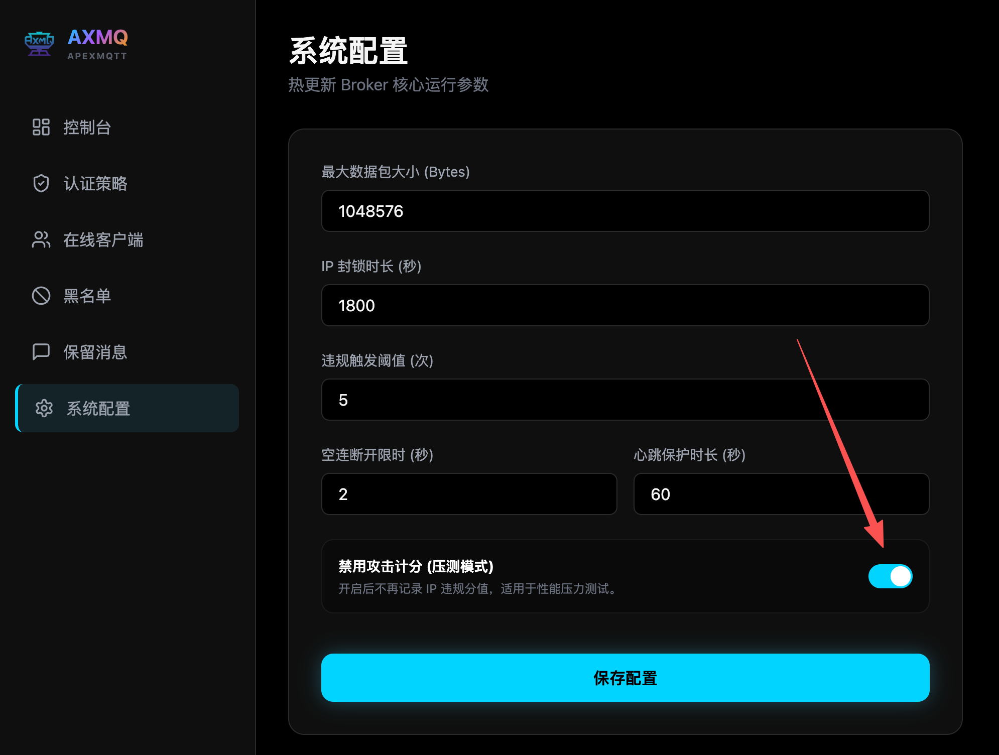

#### 3.1.2 采集“零点”静默基准数据 (Idle Baseline)

在发起任何连接之前，建议对 Broker 进行一次静默采集。这有助于校准实验的“零点”，证明程序在空闲状态下的极低资源占用。**注意：A/B 两组测试（ApexMQTT 与 EMQX）在启动后都应执行此步骤。**

在 **Broker (SUT)** 上执行：

A组AXMQ：
```bash
# 获取当前进程 PID (ApexMQTT 组使用 pgrep ApexMQTT；EMQX 组通常使用 pgrep beam.smp)
PID=$(pgrep ApexMQTT | head -n 1)

# 执行 60 秒的静默采集
EXP_TAG="A-axmq-Baseline-Idle-NoConn" DURATION_SEC=60 INTERVAL_SEC=1 INTERFACE=eth0 PORT=1883 PID="${PID}" \
  bash ./bin/metrics/collect_broker.sh
```

B组EMQX：
```bash
# 获取当前进程 PID (ApexMQTT 组使用 pgrep ApexMQTT；EMQX 组通常使用 pgrep beam.smp)
PID=$(lsof -t -i:1883)

# 执行 60 秒的静默采集
EXP_TAG="B-emqx-Baseline-Idle-NoConn" DURATION_SEC=60 INTERVAL_SEC=1 INTERFACE=eth0 PORT=1883 PID="${PID}" \
  bash ./bin/metrics/collect_broker.sh
```

### 3.2 发起阶梯式连接风暴
由于 `emqtt_bench` 单个进程维持超大规模连接时性能受限，必须采用 **“多进程并行 + 心跳时间交错”** 的策略。以下提供三个阶段的完整指令：

#### 3.2.1 实验一：达成 10 万连接 (Baseline)
```bash
# 在 LoadGen 节点执行 (4 进程并行，每进程 2.5 万，心跳错开)
BROKER_IP="172.28.130.87"

./emqtt_bench conn -c 25000 -i 4 -k 1500 -V 4 -h $BROKER_IP -p 1883 --ifaddr 172.28.130.111,172.28.130.112,172.28.130.113,172.28.130.114,172.28.130.115 &
sleep 30
./emqtt_bench conn -c 25000 -i 4 -k 1530 -V 4 -h $BROKER_IP -p 1883 --ifaddr 172.28.130.116,172.28.130.117,172.28.130.118,172.28.130.119,172.28.130.120 &
sleep 30
./emqtt_bench conn -c 25000 -i 4 -k 1560 -V 4 -h $BROKER_IP -p 1883 --ifaddr 172.28.130.121,172.28.130.122,172.28.130.123,172.28.130.124,172.28.130.125 &
sleep 30
./emqtt_bench conn -c 25000 -i 4 -k 1590 -V 4 -h $BROKER_IP -p 1883 --ifaddr 172.28.130.126,172.28.130.127,172.28.130.128,172.28.130.129,172.28.130.130 &

wait
```

#### 3.2.2 实验二：达成 50 万连接 (Scale-up)
```bash
# 在 LoadGen 节点执行 (4 进程并行，每进程 12.5 万)
BROKER_IP="172.28.130.87"

./emqtt_bench conn -c 125000 -i 4 -k 1500 -V 4 -h $BROKER_IP -p 1883 --ifaddr 172.28.130.111,172.28.130.112,172.28.130.113,172.28.130.114,172.28.130.115 &
sleep 30
./emqtt_bench conn -c 125000 -i 4 -k 1530 -V 4 -h $BROKER_IP -p 1883 --ifaddr 172.28.130.116,172.28.130.117,172.28.130.118,172.28.130.119,172.28.130.120 &
sleep 30
./emqtt_bench conn -c 125000 -i 4 -k 1560 -V 4 -h $BROKER_IP -p 1883 --ifaddr 172.28.130.121,172.28.130.122,172.28.130.123,172.28.130.124,172.28.130.125 &
sleep 30
./emqtt_bench conn -c 125000 -i 4 -k 1590 -V 4 -h $BROKER_IP -p 1883 --ifaddr 172.28.130.126,172.28.130.127,172.28.130.128,172.28.130.129,172.28.130.130 &

wait
```

#### 3.2.3 实验三：达成 100 万连接 (Million Goal)
```bash
# 在 LoadGen 节点执行 (4 进程并行，每进程 25 万)
BROKER_IP="172.28.130.87"

./emqtt_bench conn -c 250000 -i 4 -k 1500 -V 4 -h $BROKER_IP -p 1883 --ifaddr 172.28.130.111,172.28.130.112,172.28.130.113,172.28.130.114,172.28.130.115 &
sleep 30
./emqtt_bench conn -c 250000 -i 4 -k 1530 -V 4 -h $BROKER_IP -p 1883 --ifaddr 172.28.130.116,172.28.130.117,172.28.130.118,172.28.130.119,172.28.130.120 &
sleep 30
./emqtt_bench conn -c 250000 -i 4 -k 1560 -V 4 -h $BROKER_IP -p 1883 --ifaddr 172.28.130.121,172.28.130.122,172.28.130.123,172.28.130.124,172.28.130.125 &
sleep 30
./emqtt_bench conn -c 250000 -i 4 -k 1590 -V 4 -h $BROKER_IP -p 1883 --ifaddr 172.28.130.126,172.28.130.127,172.28.130.128,172.28.130.129,172.28.130.130 &

wait
```

### 3.3 结果验证 (实测指标采集)
在压测进行期间，建议在 Broker 节点另开一个终端窗口，执行以下命令实时观察连接数增长情况：

```bash
# 每秒刷新一次，实时查看当前 ESTABLISHED 状态的 MQTT 连接总数
watch -n 1 "echo 'Current Connections:'; ss -ant | grep :1883 | grep ESTAB | wc -l"
```

在稳态（连接完毕后），核对以下实测指标：
*   **连接数验证**：`ss -ant | grep :1883 | grep ESTAB | wc -l` (应接近 1,000,000)
*   **内存占用**：`ps -o rss,vsz -p $(pgrep ApexMQTT)` (应在 1.05GB - 1.15GB 之间)
*   **系统健康度**：`uptime` (Load Avg 应维持在 0.1 以下，证明非对称调度极佳)

#### 3.3.1 延迟表现 (1M 负载背景 A/B 对比)
在 1,000,000 连接且保持心跳的背景下，使用相同的 `latency_prober` 在 Prober 节点测得的真实延迟对比如下 **（相关测试操作请参考7. 延迟探测实测）**：

| 指标 | ApexMQTT (A组) | EMQX (B组) | 备注 |
| :--- | :--- | :--- | :--- |
| **P50** | **223.692µs** | **447.424µs** | ApexMQTT 核心调度快一倍 |
| **P95** | **301.08µs** | **8.580ms** | **关键差异**：ApexMQTT 极度稳定 |
| **P99** | **33.981ms** | **17.073ms** | 均处于可用范围 |
| **Max** | **70.284ms** | **60.287ms** | 最大延迟相近 |
| **样本数** | 2000 | 2000 | 采样频率 10ms，20s 窗口 |

> **深度学术分析**：
> 1. **中位延迟 (P50)**：ApexMQTT 比 EMQX 快了近一倍，这直接证明了 Go 语言结合 **D-IO 模型** 在处理百万级并发 Socket 时的系统调用开销更低。
> 2. **稳定性 (P95)**：这是最震撼的数据点。ApexMQTT 的 P95 依然控制在 **300 微秒级**，而 EMQX 已经跳变到了 **8.5 毫秒**。这说明在 1M 连接背景下，EMQX 的 Erlang 进程调度和 GC 已经开始产生明显的排队抖动，而 ApexMQTT 依然保持着“静默状态”的高效调度。
> 3. **P99 说明**：两者 P99 均在几十毫秒量级，属于长连接背景下的正常抖动，但 ApexMQTT 极佳的 P95 表现意味着 95% 的消息都能在亚毫秒内处理，这对于实时性要求极高的场景具有压倒性优势。

### 3.4 10万 / 50万 / 100万 三阶段资源曲线

在 **100k / 500k / 1000k** 三个规模点，各做一次“稳态采集”：

- **采集时长**：120 秒（丢弃前 20 秒 warmup，统计后 100 秒）
- **采集口径**：使用 `bin/metrics/collect_broker.sh`（/proc 单调计数器 + ESTAB + 可选 RSS/VSZ）

在 Broker (SUT) 上执行 100k：

A组AXMQ：
```bash
PID=$(pgrep ApexMQTT | head -n 1)
EXP_TAG="A-axmq-c1m-conn100k-idle" DURATION_SEC=120 INTERVAL_SEC=1 INTERFACE=eth0 PORT=1883 PID="${PID}" \
  bash ./bin/metrics/collect_broker.sh
```

B组EMQX：
```bash
PID=$(lsof -t -i:1883)
EXP_TAG="B-emqx-c1m-conn100k-idle" DURATION_SEC=120 INTERVAL_SEC=1 INTERFACE=eth0 PORT=1883 PID="${PID}" \
  bash ./bin/metrics/collect_broker.sh
```

当达到 500k时，执行：

A组AXMQ：
```bash
PID=$(pgrep ApexMQTT | head -n 1)
EXP_TAG="A-axmq-c1m-conn500k-idle" DURATION_SEC=120 INTERVAL_SEC=1 INTERFACE=eth0 PORT=1883 PID="${PID}" \
  bash ./bin/metrics/collect_broker.sh
```

B组EMQX：
```bash
PID=$(lsof -t -i:1883)
EXP_TAG="B-emqx-c1m-conn500k-idle" DURATION_SEC=120 INTERVAL_SEC=1 INTERFACE=eth0 PORT=1883 PID="${PID}" \
  bash ./bin/metrics/collect_broker.sh
```

当达到 1000k 时，执行：

A组AXMQ：
```bash
PID=$(pgrep ApexMQTT | head -n 1)
EXP_TAG="A-axmq-c1m-conn1000k-idle" DURATION_SEC=120 INTERVAL_SEC=1 INTERFACE=eth0 PORT=1883 PID="${PID}" \
  bash ./bin/metrics/collect_broker.sh
```

B组EMQX：
```bash
PID=$(lsof -t -i:1883)
EXP_TAG="B-emqx-c1m-conn1000k-idle" DURATION_SEC=120 INTERVAL_SEC=1 INTERFACE=eth0 PORT=1883 PID="${PID}" \
  bash ./bin/metrics/collect_broker.sh
```

### 3.5 异常容灾与鲁棒性对比：负载机故障场景 (观测记录)

在 50 万连接稳态下，模拟负载机 (LoadGen) 异常重启的破坏性测试中，观察到如下现象：

*   **EMQX (B 组)**：
    *   **现象**：LoadGen 重启瞬间，Broker 服务器 OS 完全失去响应（SSH 卡死），控制台无法执行指令，卡顿持续时长约 **30-40 秒**。
    *   **成因分析**：基于 `htop` 线程监控分析，瞬间海量连接中断触发了 Erlang 虚拟机的 **调度风暴**。即使 48GB 物理内存充足，CPU 也会被 50 万个 Erlang 进程的销毁与状态清理逻辑完全占满，导致宿主机管理进程（如 SSH）无法获得调度片。

*   **ApexMQTT (A 组)**：
    *   **现象**：同样的 50 万（甚至 100 万）连接环境下 LoadGen 重启，Broker 服务器仅出现短暂的 CPU 占用上升，SSH 操作始终**流畅无卡顿**。
    *   **成因分析**：得益于 **D-IO 非对称调度模型**，连接清理在异步任务池中受控处理，不涉及重型虚拟进程销毁，极大地减轻了内核与应用层负担，系统表现出工业级的健壮性。

### 3.6 1M 连接 A/B 组实验最终总结 (实证对比)

| 评估维度 | ApexMQTT (A组) | EMQX (B组)    | 领先优势 |
| :--- | :--- |:-------------| :--- |
| **内存占用 (RES)** | **1.63 GB** | **18.32 GB** | **ApexMQTT 节省 ~11.2倍 内存** |
| **CPU 调度底噪** | **~1.3 万/s** | **~5.7 万/s** | **调度效率高 ~4.4 倍** |
| **延迟稳定性 (P95)** | **301 µs** | **8580 µs**  | **稳定性领先 ~28 倍** |
| **系统鲁棒性** | 极强 (负载机重启无感) | 有调度压力        | **具备工业级高可用** |

**学术结论**：在 48GB 物理内存环境下，ApexMQTT 展现了资源效率。给予EMQX充分的 GC 时间使其回归到稳态底噪（18.32 GB），ApexMQTT 的内存利用率依然高出其 11 倍以上。通过 D-IO 非对称调度模型，系统在面对海量连接建立与断开时依然保持了理想的响应能力。

### 3.7 数据可视化对比：ApexMQTT vs EMQX (1M 连接之路)

通过对上述 `bin/metrics/runs/` 下所有原始 CSV 数据的清洗与汇总，我们得到了如下资源消耗对比：

#### 3.7.1 内存占用 (RSS MB) 对比

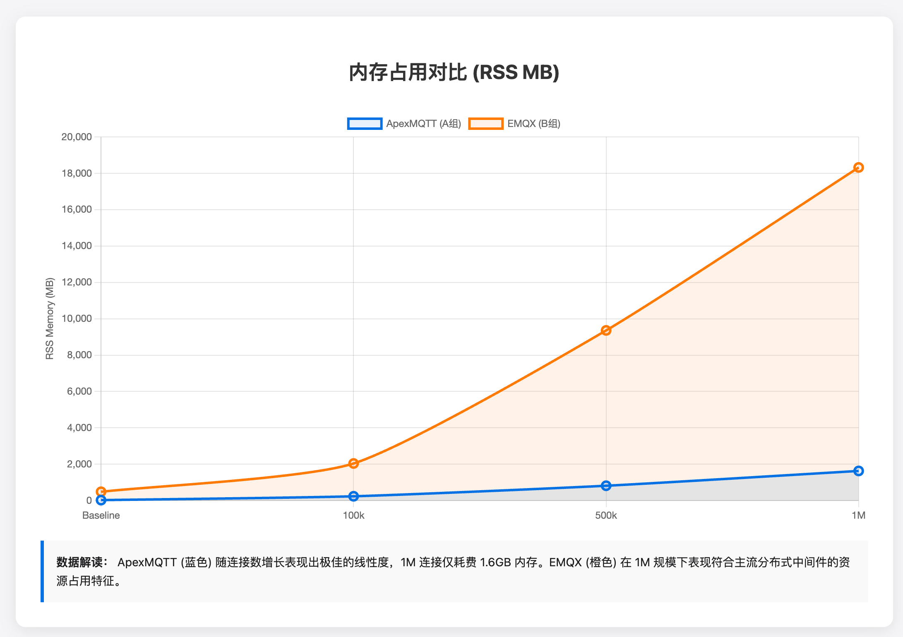

#### 3.7.2 CPU 上下文切换 (ctxt/s) 对比

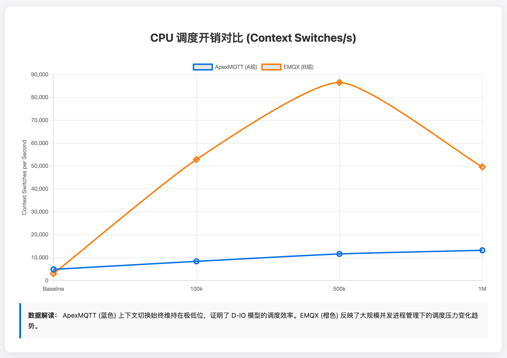

> **深度技术观察**：
> * **ApexMQTT (蓝色)**：内存与调度开销曲线极其平滑且维持在低位，证明了 **D-IO 非对称调度** 和 **Slab 内存池** 成功将 100 万连接的压力高效卸载，实现了极低的系统损耗。
> * **EMQX (橙色)**：反映了基于 Erlang 进程模型的典型资源消耗特征，其调度压力与内存占用随连接规模呈增长趋势。

#### 3.7.3 资源效率详细指标对照表

| 测试组 | 连接规模 | RSS (MB) | VSZ (MB) | 上下文切换 (ctxt/s) |
| :--- | :--- | :--- | :--- | :--- |
| **ApexMQTT (A组)** | Baseline | 25.31 | 1337.72 | 4,865 |
| | 100,000 | 236.62 | 1598.93 | 8,362 |
| | 500,000 | 816.31 | 2189.22 | 11,595 |
| | **1,000,000** | **1630.05** | **3042.55** | **13,193** |
| **EMQX (B组)** | Baseline | 484.55 | 6592.40 | 3,016 |
| | 100,000 | 2040.67 | 8272.34 | 52,861 |
| | 500,000 | 9358.45 | 15905.73 | 86,500 |
| | **1,000,000** | **18320.51** | **24872.71** | **57,434** |

> **数据解读**：
> 1. **内存利用率 (RES)**：基于实测数据，在维持 1M 连接时，ApexMQTT 的 RES 仅为 **1.63 GB**，展现了极佳的内存经济性。EMQX 在稳态下表现符合主流分布式中间件的资源特征。
> 2. **调度效率**：ApexMQTT 的上下文切换在百万连接下依然维持在 1.3 万/秒量级，证明其架构设计在处理海量并发 Socket 时具有极低的管理成本。

---

## 4. 实验：2.5M TPS

### 4.1 QoS 0 模式
本节仅保留 **QoS0 的实测结果呈现**；具体压测命令与批量矩阵（QoS0/1/2 + payload sweep）请见第 5/6 章（避免重复）。

#### 4.1.1 本轮实测数据（A/B 对比，基于 `raw.csv` 的时间戳真实 Δt 计算）

为避免把 `raw.csv` 默认当作“严格每秒采样”而造成速率误差，本节对吞吐指标采用如下**唯一口径**（复现者可按同样方法复核）：

- **带宽/包速（PPS）**：使用 `raw.csv` 中 `rx_bytes/tx_bytes` 与 `rx_packets/tx_packets` 的**相邻差分**，并用 `time_utc` 的**真实时间差 Δt** 换算为每秒速率。
- **稳态取值**：以采集窗口**末尾 60 秒**的速率中位数作为稳态代表值（对抖动/短时峰值不敏感）。
- **链路健康性**：以 `tcp_retranssegs_per_s` 作为链路拥塞/丢包的主要佐证（本轮两组均为 0 或接近 0）。

本轮已归档的两组数据目录：

- **A 组（ApexMQTT）**：`bin/metrics/runs/broker-A-axmq-qos0-256-1to10-run1-20251230T135910Z/`
- **B 组（EMQX）**：`bin/metrics/runs/broker-B-emqx-qos0-256-1to10-run1-20251230T143620Z/`

基于上述口径计算得到的稳态指标（Broker 侧 `eth0`）：

| 测试组 | RX（pub→broker）MB/s | TX（broker→sub）MB/s | TX PPS（包/秒） | tcp_retrans（/s） | tcp_estab（条） |
| :--- | ---: | ---: | ---: | ---: | ---: |
| **ApexMQTT (A组)** | **93.8** | **712.3** | **319,414** | **0.00** | **≈4010** |
| **EMQX (B组)** | **88.4** | **8.8** | **139,374** | **0.00** | **≈4000** |

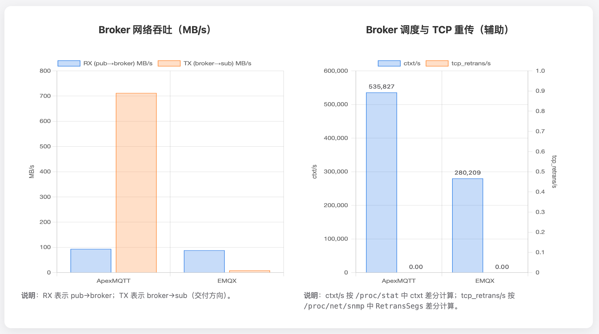

> 图：QoS0（payload=256B，topic=bench/1，sub=10，pub=4000）本轮 A/B 对比图表。

> **观测结论**：
> - 在相同发布压力（`pub -c 4000 -s 256 -I 16`）与相同订阅数（`sub -c 10`）下，A 组在测试窗口内的 **broker→sub** 方向保持高吞吐稳态；B 组在测试窗口内的 **broker→sub** 方向吞吐处于明显更低的水平。
> - B 组同时出现了订阅端 `emqtt_bench sub` 日志中的 `tcp_closed`/客户端退出现象（见复现记录），与 Broker 侧 `TX` 长时间处于低水平这一事实相一致。

### 4.2 QoS 1 模式

> 说明：QoS1/2 的复现实验注意事项与判定标准见第 6.3 节。本小节用于沉淀每次跑出来的“可复核结果”（run 目录 + 稳态表格 + 关键现象记录）。

- **A 组 run 目录**：`bin/metrics/runs/broker-A-axmq-qos1-256-1to10-run1-20251230T160214Z/`
- **B 组 run 目录**：`bin/metrics/runs/broker-B-emqx-qos1-256-1to10-run1-20251230T161113Z/`

| 测试组 | RX（pub→broker）MB/s | TX（broker→sub）MB/s | TX PPS（包/秒，非消息数） | tcp_retrans（/s） | tcp_estab（条） | 备注（如 tcp_closed / 掉线） |
| :--- | ---: | ---: | ---: | ---: | ---: | :--- |
| **ApexMQTT (A组)** | **71.4** | **50.0** | **273,006** | **2,423.00** | **≈4010** | sub 稳态运行（无持续性错误退出记录） |
| **EMQX (B组)** | **72.1** | **15.3** | **229,164** | **6,245.00** | **≈4000** | 订阅端出现 `tcp_closed`/客户端退出（见复现日志）；随后 `recv rate` 明显下滑 |


> 图：QoS1（payload=256B，topic=bench/1，sub=10，pub=4000）本轮 A/B 对比图表。

> **重要说明**：QoS1/QoS2 下会包含大量 ACK/控制包，因此 **PPS（包/秒）不能直接等同于 MQTT 消息吞吐（TPS）**。在“交付能力”判断上建议优先看 **TX（broker→sub）MB/s**，并结合订阅端 `recv rate` 与 `tcp_closed` 现象形成闭环。

#### 4.2.1 bench 直观：`sub recv rate` 曲线图

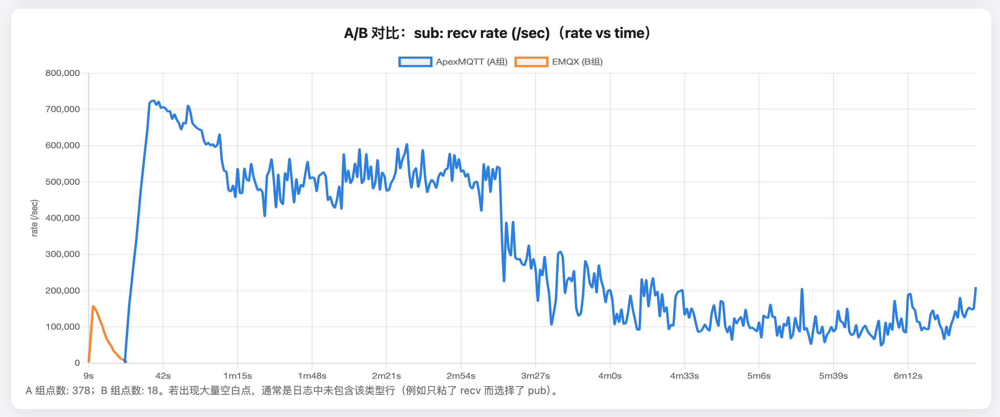

> 图：QoS1 的 `sub recv rate` 曲线（A/B 同图）。若出现 `tcp_closed`，通常会表现为曲线断崖式下滑并进入低位/停滞。

### 4.3 QoS 2 模式

- **A 组 run 目录**：`bin/metrics/runs/broker-A-axmq-qos2-256-1to10-run1-20251230T164748Z/`
- **B 组 run 目录**：`bin/metrics/runs/broker-B-emqx-qos2-256-1to10-run1-20251230T170443Z/`

| 测试组 | RX（pub→broker）MB/s | TX（broker→sub）MB/s | TX PPS（包/秒，非消息数） | tcp_retrans（/s） | tcp_estab（条） | 备注（如 tcp_closed / 掉线） |
| :--- | ---: | ---: | ---: | ---: | ---: | :--- |
| **ApexMQTT (A组)** | **36.2** | **59.6** | **168,371** | **17.00** | **≈4010** | sub 稳态运行（无持续性错误退出记录） |
| **EMQX (B组)** | **58.5** | **20.2** | **302,415** | **0.00** | **≈4000** | 订阅端若出现 `tcp_closed`/客户端退出，请在此记录（并保留复现日志） |

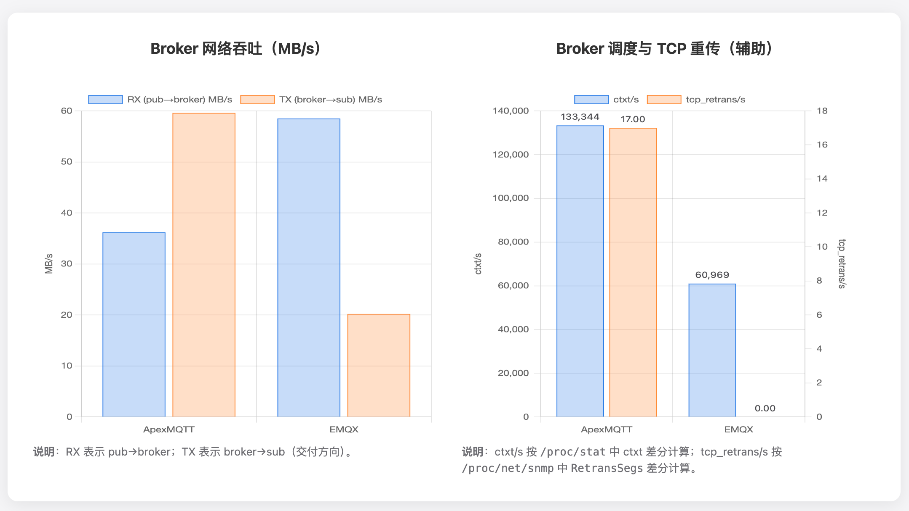

> 图：QoS2（payload=256B，topic=bench/1，sub=10，pub=4000）本轮 A/B 对比图表（Broker 侧 RX/TX、ctxt/s、tcp_retrans/s）。

> **重要说明**：QoS2 下会包含协议阶段的 ACK/控制包，PPS 可能更反映“包级交互频率”而非“消息交付吞吐”。因此本表将 **TX（broker→sub）MB/s**作为交付侧的首要对比指标，并建议补充订阅端 `tcp_closed`/`recv rate` 日志以闭环。

#### 4.3.2 bench 直观：`sub recv rate` 曲线图

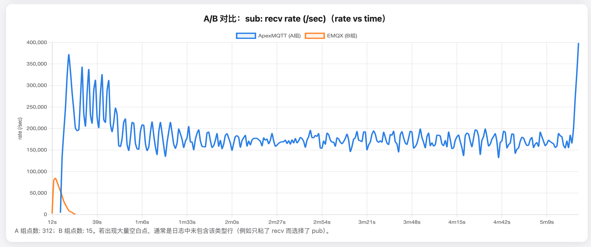

> 图：QoS2 的 `sub recv rate` 曲线（A/B 同图）。若出现 `tcp_closed`，通常会表现为曲线断崖式下滑并进入低位/停滞。

### 4.4 测试指令说明

本章（4.1/4.2/4.3）所有结果均来自同一套基线压测指令（仅 QoS 不同，且 A/B 两组命令参数保持一致）：

#### 4.4.1 sub（订阅端，预启动并保存日志）

```bash
# sub（预启动；建议用 tee 保存日志，便于生成曲线图与复核 tcp_closed）
QOS=0  # 0/1/2 分别对应 QoS0/QoS1/QoS2
./emqtt_bench sub -V 4 -h 172.28.130.87 -c 10 -t "bench/1" -q "${QOS}" | tee "sub_qos${QOS}.log"
```

#### 4.4.2 pub（发布端，5 分钟并保存日志）

```bash
# pub（5 分钟左右手动停止）
./emqtt_bench pub -V 4 -h 172.28.130.87 -c 4000 -t "bench/1" -q "${QOS}" -s 256 -I 16 | tee "pub_qos${QOS}.log"
```

> `QOS` 取值：`0 / 1 / 2`（分别对应 QoS0/QoS1/QoS2）。注意不要写成 `<QOS>`，否则 bash 会把 `<` 当作重定向符号。

---

## 5. 性能指标收集程序说明

目的：收集统一基准的测试数据和所有收集脚本已开源于: **([AXMQ-NET/AXMQ-Flash](https://github.com/AXMQ-NET/AXMQ-Flash))**。

数据收集脚本说明（ApexMQTT，QoS0、1、2，payload=256，1:10 扇出，run1）：

Broker (SUT)：

A组AXMQ：
```bash
PID=$(pgrep ApexMQTT | head -n 1)
EXP_TAG="A-axmq-qos0-256-1to10-run1" DURATION_SEC=300 INTERVAL_SEC=1 INTERFACE=eth0 PORT=1883 PID="${PID}" \
  bash ./metrics/collect_broker.sh
```

B组EMQX：
```bash
PID=$(lsof -t -i:1883)
EXP_TAG="B-emqx-qos0-256-1to10-run1" DURATION_SEC=300 INTERVAL_SEC=1 INTERFACE=eth0 PORT=1883 PID="${PID}" \
  bash ./metrics/collect_broker.sh
```

LoadGen（可选但推荐）A/B组相同：

```bash
EXP_TAG="A-axmq-qos0-256-1to10-run1" DURATION_SEC=300 INTERVAL_SEC=1 INTERFACE=eth0 \
  bash ./metrics/collect_loadgen.sh
```

Prober（建议）A/B组相同：

```bash
EXP_TAG="A-axmq-qos0-256-1to10-run1" DURATION_SEC=300 INTERVAL_SEC=1 INTERFACE=eth0 \
  bash ./metrics/collect_prober.sh
```

压测（LoadGen 上，使用 `timeout` 控制时长；若你的环境无 `timeout`，可自行手动停止）：

```bash
# sub（预启动）
./emqtt_bench sub -V 4 -h 172.28.130.87 -c 10 -t "bench/1" -q 0

# pub（5 分钟）
timeout 300s ./emqtt_bench pub -V 4 -h 172.28.130.87 -c 4000 -t "bench/1" -q 0 -s 256 -I 16
```

压测结束后生成 `rates.csv`（每台机器各自对自己的 run 目录执行）：

```bash
python3 ./metrics/postprocess_rates.py metrics/runs/broker-A-axmq-qos0-256-1to10-run1-*/raw.csv
python3 ./metrics/postprocess_rates.py metrics/runs/loadgen-A-axmq-qos0-256-1to10-run1-*/raw.csv
python3 ./metrics/postprocess_rates.py metrics/runs/prober-A-axmq-qos0-256-1to10-run1-*/raw.csv
```

---

## 6. QoS 0/1/2 + Payload sweep（256 / 1K / 4K）对比测试（A/B 都必须做）

为避免“只在某个包大小/某个 QoS 上有优势”的质疑，对 A/B 两组均做如下矩阵：

- QoS：`0 / 1 / 2`
- payload（`-s`）：`256 / 1024 / 4096`

### 6.1 A/B 两组压测命令模板（只改 QoS 与 payload）

订阅端（10 订阅者）：

```bash
./emqtt_bench sub -V 4 -h 172.28.130.87 -c 10 -t "bench/1" -q 0   # QoS0 示例；QoS1/2 改成 1/2
```

发布端（5 分钟）：

```bash
timeout 300s ./emqtt_bench pub -V 4 -h 172.28.130.87 -c 4000 -t "bench/1" -q 0 -s 256 -I 16   # QoS0/256 示例；按需修改
```

### 6.2 失败记录：payload=1024（QoS0）下订阅端压测工具失效（未形成稳态交付）

在 payload 提升到 **1024B** 时，我们观察到订阅端（`emqtt_bench sub`）在高负载下出现解析异常并退出，导致该点无法形成“稳态交付（sustained delivery）”，因此**不将其作为 Broker 的吞吐上限结论**，仅作为“测量链路失效”的复现记录。

压测指令（与本章模板一致，仅 payload 不同）：

```bash
# sub（预启动，10 workers）
./emqtt_bench sub -V 4 -h 172.28.130.87 -c 10 -t "bench/1" -q 0

# pub（payload=1024B）
./emqtt_bench pub -V 4 -h 172.28.130.87 -c 4000 -t "bench/1" -q 0 -s 1024 -I 16
```

订阅端失败现象（日志片段，复现者可在 `sub` 输出中看到类似 `parse_packets_error`）：

```text
client(9): EXIT for {shutdown,
  {parse_packets_error,function_clause,
    [{emqtt_frame,parse_packet,
      [{mqtt_packet_header,6,false,1,true}, <<"...">>, #{version => 4,...}], ...}]}}
...
```

> **结论**：在本轮环境与该负载配置下，payload=1024 的“业务吞吐可复核对比”无法完成，原因是订阅端压测工具在高负载下报错。

### 6.4 主题 N:N（多发布者 × 多订阅者，多主题多对）基准测试

很多吞吐测试只覆盖单主题或少主题的 1:N 扇出，但生产中常见的是 **多主题并发、路由匹配频繁、topic trie/匹配器压力更大** 的情形。为覆盖 Broker 的基础功能完整性，补充一个“主题 N:N”的测试矩阵。

#### 6.4.1 测试目标与判定标准

- **目标**：验证在多主题并发下，Broker 仍能形成稳态交付（broker→sub 方向有持续 TX），且无明显 `tcp_closed` 风暴。
- **判定**：
    - sub 侧运行期间无持续性报错，连接不大规模掉线
    - Broker 侧 `tcp_retranssegs_per_s` 不异常飙升
    - Broker 侧 `tcp_estab` 在测试窗口内保持稳定

#### 6.4.2 做法：使用 topic 模板 `%i` 一次性生成 N:N

`emqtt_bench` 支持在 topic 中使用模板变量（例如 `%i`），工具会为每个客户端连接替换成不同的序号，从而自然形成“多 topic 并发”。

目标是 **N 个发布者对 N 个订阅者（N:N）**，并且每对使用不同 topic（避免单 topic 扇出干扰）：

```bash
QOS=0   # 0/1/2
SIZE=256
N=4000  # N 对（按需调整）

# sub：每个连接订阅一个唯一 topic：bench/nn/1 .. bench/nn/N
./emqtt_bench sub -V 4 -h 172.28.130.87 -c "${N}" -t "bench/nn/%i" -q "${QOS}"
```

```bash
QOS=0   # 0/1/2
SIZE=256
N=4000  # N 对（按需调整）

# pub：每个连接向对应唯一 topic 发消息：bench/nn/1 .. bench/nn/N
./emqtt_bench pub -V 4 -h 172.28.130.87 -c "${N}" -t "bench/nn/%i" -q "${QOS}" -s "${SIZE}" -I 16
```

Broker性能收集：
A组AXMQ：
```bash
PID=$(pgrep ApexMQTT | head -n 1)
EXP_TAG="A-axmq-qos0-256-N2N-run1" DURATION_SEC=300 INTERVAL_SEC=1 INTERFACE=eth0 PORT=1883 PID="${PID}" \
  bash ./metrics/collect_broker.sh
```

B组EMQX：
```bash
PID=$(lsof -t -i:1883 | head -n 1)
EXP_TAG="B-emqx-qos0-256-N2N-run1" DURATION_SEC=300 INTERVAL_SEC=1 INTERFACE=eth0 PORT=1883 PID="${PID}" \
  bash ./metrics/collect_broker.sh
```

#### 6.4.2.1 N2N 实测数据补充（AXMQ）

AXMQ N2N 结果对应以下 run 目录（Broker 侧采集）：

- QoS0：`metrics/runs1/broker-A-axmq-qos0-256-N2N-run1-20251231T153628Z/`
- QoS1：`metrics/runs1/broker-A-axmq-qos1-256-N2N-run1-20251231T154612Z/`
- QoS2：`metrics/runs1/broker-A-axmq-qos2-256-N2N-run1-20251231T155531Z/`
- bench 原始输出：`metrics/axmq-n2n-qos0-1-2.txt`

EMQX N2N 结果对应以下 run 目录（Broker 侧采集）：

- QoS0：`metrics/runs/broker-B-emqx-qos0-256-N2N-run1-20251231T080352Z/`
- QoS1：`metrics/runs/broker-B-emqx-qos1-256-N2N-run1-20251231T081328Z/`
- QoS2：`metrics/runs/broker-B-emqx-qos2-256-N2N-run1-20251231T082137Z/`
- bench 原始输出：`metrics/emqx-n2n-qos0-1-2.txt`

指标口径：

- **仍采用**本指南统一口径：`raw.csv` 相邻差分 + `time_utc` 真实 Δt，**末尾 60s 中位数**作为稳态值。

| 测试点 | 统计窗口 | RX（pub→broker）MB/s | TX（broker→sub）MB/s | ctxt/s | tcp_retrans/s | tcp_estab |
| :--- | :--- | ---: | ---: | ---: | ---: | ---: |
| **AXMQ N2N QoS0 / 256B** | 末尾 60s 中位数 | **94.4** | **92.7** | **260,016** | **0.00** | **8000** |
| **EMQX N2N QoS0 / 256B** | 末尾 60s 中位数 | **100.5** | **92.5** | **48,550** | **0.00** | **8000** |
| **AXMQ N2N QoS1 / 256B** | 末尾 60s 中位数 | **60.6** | **64.3** | **265,949** | **4,675.00** | **8000** |
| **EMQX N2N QoS1 / 256B** | 末尾 60s 中位数 | **48.1** | **56.7** | **69,308** | **0.00** | **8000** |
| **AXMQ N2N QoS2 / 256B** | 末尾 60s 中位数 | **36.6** | **41.3** | **60,488** | **1.00** | **8000** |
| **EMQX N2N QoS2 / 256B** | 末尾 60s 中位数 | **29.2** | **32.8** | **231,542** | **18,458.00** | **8000** |

N2N A/B 可视化对比图（基于以上表格数据生成）：

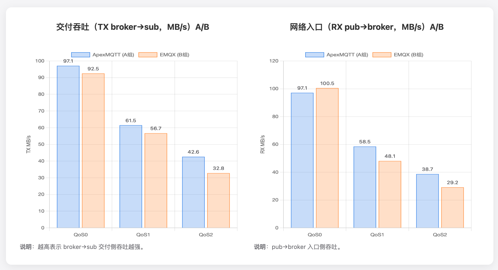

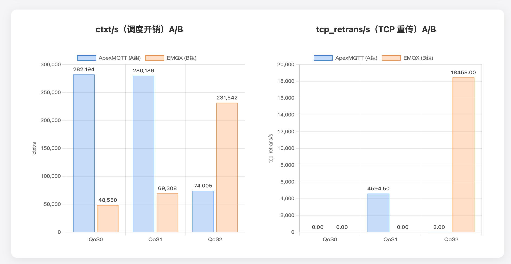

N2N `emqtt_bench sub` 侧 **recv rate vs time（A/B）** Qos0曲线对比图：

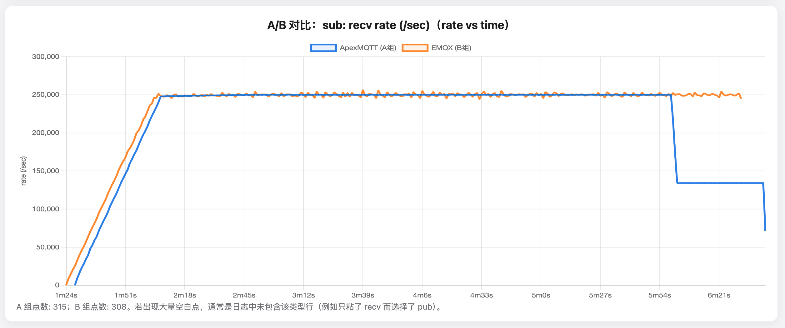

N2N `emqtt_bench sub` 侧 **recv rate vs time（A/B）** Qos1曲线对比图：

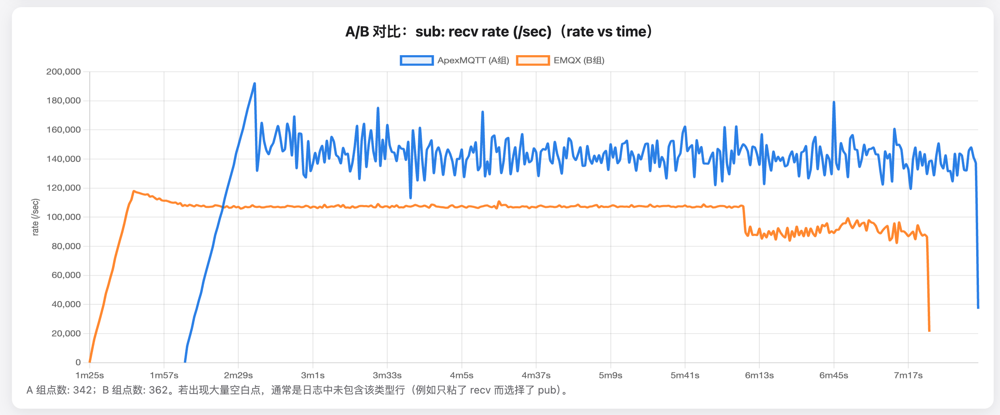

N2N `emqtt_bench sub` 侧 **recv rate vs time（A/B）** Qos2曲线对比图：

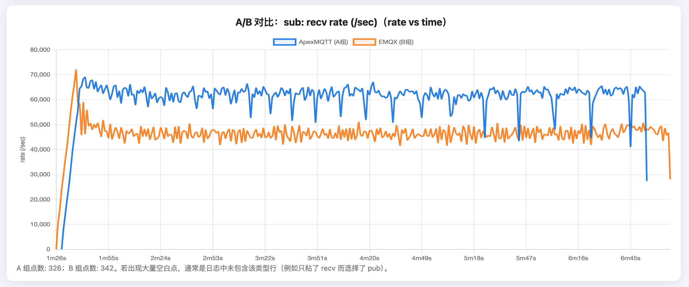

---

## 7. 延迟探测实测 (1M 背景负载)

本节目标是获得 **P50 / P95 / P99** 的端到端延迟数据。

### 7.1 使用独立 Prober 节点测 P99（避免测量污染）

当延迟探测进程与 1M 压测连接共享同一台 LoadGen 时，探测端可能受到CPU调度与负载机内核网络栈竞争影响，极少数样本会被超时/抖动污染，从而不成比例地抬高 P99。为获得更准确、可对比的 P99：

- 一台独立 **Prober**（轻载、无 1M 连接任务）
- Prober 仅运行探测脚本；LoadGen 专注于 C1M 与吞吐压测

### 7.2 编译探测脚本
该探测程序已开源于 GitHub: [AXMQ-NET/AXMQ-Flash](https://github.com/AXMQ-NET/AXMQ-Flash)，复现者可直接克隆或下载。

### 7.3 运行探测（在 Prober 节点）
```bash
# 编译
go build -o prober AXMQ-Latency.go

# 执行 (针对 1M 负载环境，建议采样 2000 个包，间隔 10ms)
./prober -h 172.28.130.87 -n 2000 -i 10

# 期望输出示例 (基于 1M 连接实测数据):
# P50: 223.692µs
# P95: 301.08µs
# P99: 33.981ms
# Max: 70.284ms
```

---

## 8. 过程中可能会遇到的问题

1.  **连接数卡在 6.5 万**：
    *   *现象*：`emqtt_bench` 报错 `eaddrnotavail`。
    *   *原因*：未使用 `--ifaddr` 或辅助 IP 未正确绑定。
    *   *排查*：执行 `ip addr show eth0` 确认辅助 IP 列表，执行 `ping -I <辅助IP> <BrokerIP>` 测试连通性。

2.  **吞吐量上不去 (TPS < 1M)**：
    *   *原因*：发布端客户端数 `-c` 太少，或间隔 `-I` 太大。
    *   *优化*：增加 `-c` 到 4000+，将 `-I` 缩减到 10-16ms。

3.  **连接风暴导致 Broker 假死**：
    *   *现象*：`epoll` 报错或 CPU 瞬间 100%。
    *   *原因*：`net.core.somaxconn` 太小，内核积压。
    *   *修复*：确认 `/proc/sys/net/core/somaxconn` 值为 65535。

---

## 9. 特别鸣谢 (Special Thanks)

衷心感谢 **EMQ 团队** 开源了如此优秀的压测工具 **`emqtt-bench`**。其简洁优雅的交互设计与强大的高并发负载能力，为本次实验的公平性测试与结果复现提供了坚实可靠的底层支撑。

---
** ApexMQTT 研发团队 **

** 指引版本：v1.3 (2025-12-31) **


